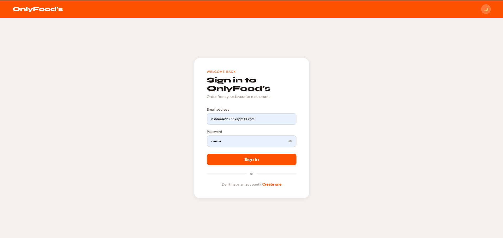
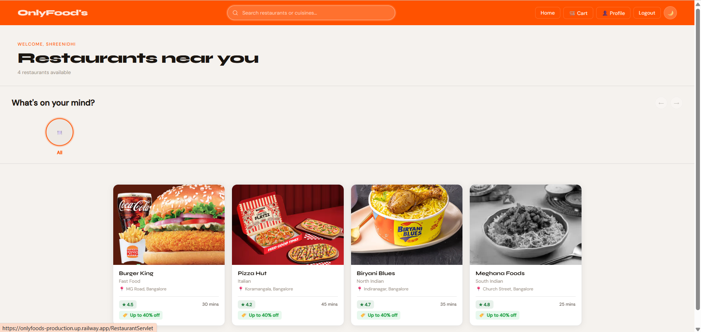
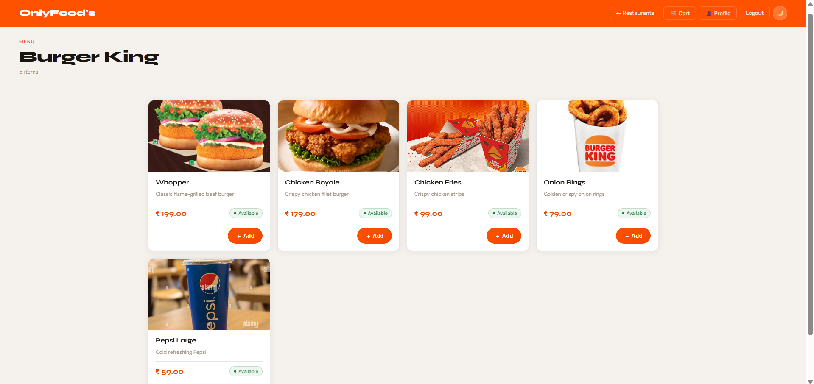
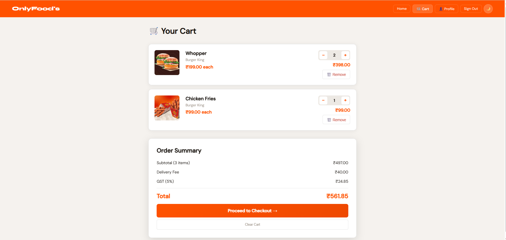
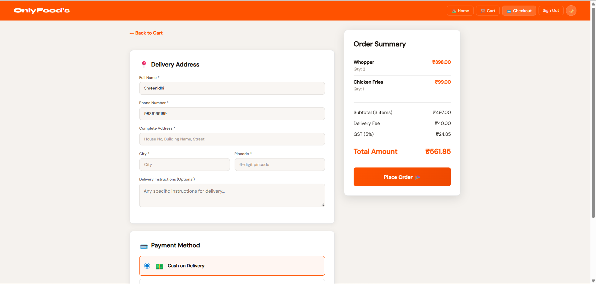
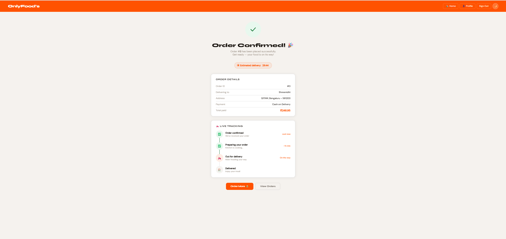
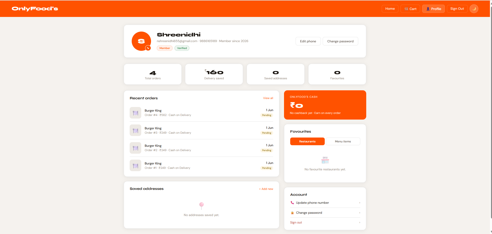
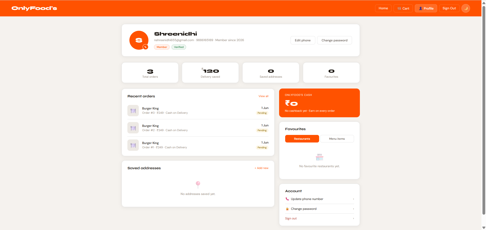

<div align="center">

# 🍔 OnlyFoods

### A full-stack food delivery web application built with Java, Jakarta EE & MySQL

[](https://onlyfoods-production.up.railway.app)
[](https://openjdk.org/projects/jdk/17/)
[](https://tomcat.apache.org/)
[](https://www.mysql.com/)
[](https://maven.apache.org/)
[](https://railway.app)

</div>

---

## 📌 Overview

**OnlyFoods** is a Swiggy-inspired food delivery web application built from scratch using core Java enterprise technologies — no Spring, no frameworks, just raw Jakarta EE Servlets, JSP, and JDBC. Users can browse restaurants, explore menus, add items to a session-based cart, and place orders with delivery address management.

> 🟢 **Live at:** [onlyfoods-production.up.railway.app](https://onlyfoods-production.up.railway.app)

---

## 📸 Screenshots

> _Register, login, browse restaurants, add to cart, checkout, and track your orders._

**Row 1 — Browsing & Ordering**

| Login | Home | Menu | Cart |
|---|---|---|---|
|  |  |  |  |

**Row 2 — Checkout & Account**

| Checkout | Order Confirmation | Order History | Profile |
|---|---|---|---|
|  |  |  |  |

---

## ✨ Features

| Feature | Details |
|---|---|
| 🔐 **Authentication** | Register, Login, Logout with BCrypt password hashing |
| 🏪 **Restaurant Browsing** | Browse all active restaurants with ratings, cuisine type & delivery time |
| 🍽️ **Menu Exploration** | View full menus per restaurant, filtered by category |
| 🛒 **Cart Management** | Add/remove items, session-based cart, real-time quantity updates |
| 📦 **Order Placement** | Checkout with saved delivery address, payment mode selection |
| 📋 **Order History** | View all past orders with detailed item breakdowns |
| 👤 **User Profile** | Manage personal details and delivery address |
| 🌙 **Dark/Light Theme** | Toggle between dark and light UI modes |
| 📱 **Responsive UI** | Mobile-friendly Swiggy-inspired design |

---

## 🛠️ Tech Stack

### Backend
- **Java 17** — Core language
- **Jakarta EE Servlets** — Request handling (no Spring MVC)
- **JDBC** — Raw database access with PreparedStatements
- **BCrypt (jBCrypt 0.4)** — Secure password hashing
- **Apache Tomcat 10.1** — Servlet container

### Frontend
- **JSP (Jakarta Server Pages)** — Server-side rendering
- **JSTL** — JSP tag library
- **CSS3** — Custom Swiggy-inspired styling
- **Vanilla JavaScript** — Cart interactions, theme toggle

### Database
- **MySQL 8.0** — Relational database
- **5 core tables:** `user`, `restaurant`, `menu`, `orders`, `orderitems`

### DevOps
- **Maven 3.9** — Build & dependency management
- **Docker** — Multi-stage containerization (Maven build → Tomcat runtime)
- **Railway** — Cloud hosting (App + MySQL)

---

## 🗂️ Project Structure

```
OnlyFoods/
├── src/main/
│   ├── java/com/OnlyFoods/
│   │   ├── model/          # POJOs — User, Restaurant, Menu, Order, OrderItem, CartItem
│   │   ├── dao/            # DAO interfaces
│   │   ├── daoimp/         # JDBC implementations
│   │   ├── Servlet/        # 11 Servlets (Register, Login, Restaurant, Menu, Cart, etc.)
│   │   └── util/           # DBConnector, PasswordUtil
│   └── webapp/
│       ├── WEB-INF/
│       │   └── web.xml     # Servlet mappings, session config
│       ├── *.jsp           # Login, Register, Home, Menu, Cart, Checkout, Orders, Profile
│       ├── css/            # Stylesheets
│       └── images/         # Restaurant & food images
├── database/
│   └── schema.sql          # Full DB schema + sample data
├── pom.xml                 # Maven build config
└── Dockerfile              # Multi-stage Docker build
```

---

## 🔌 API / Servlet Endpoints

| Servlet | URL | Method | Description |
|---|---|---|---|
| RegisterServlet | `/register` | POST | Create new user account |
| LoginServlet | `/login` | POST | Authenticate user |
| LogoutServlet | `/logout` | GET | Invalidate session |
| RestaurantServlet | `/RestaurantServlet` | GET | List all restaurants |
| MenuServlet | `/MenuServlet` | GET | Get menu for a restaurant |
| CartServlet | `/CartServlet` | GET/POST | Add/remove cart items |
| CheckoutServlet | `/CheckoutServlet` | GET | Render checkout page |
| PlaceOrderServlet | `/PlaceOrderServlet` | POST | Confirm and place order |
| OrderHistoryServlet | `/orders` | GET | View all past orders |
| OrderDetailsServlet | `/orderdetails` | GET | View single order details |
| ProfileServlet | `/profile` | GET/POST | View/update profile |

---

## 🗄️ Database Schema

```sql
user        — userid, name, email, password, phone, address
restaurant  — restaurantid, name, cuisinetype, deliverytime, address, rating
menu        — menuid, restaurantid, itemname, description, price, category
orders      — orderid, userid, restaurantid, totalamount, status, paymentmode
orderitems  — orderitemid, orderid, menuid, itemname, quantity, price, subtotal
```

---

## 🚀 Run Locally

### Prerequisites
- Java 17+
- Maven 3.9+
- MySQL 8.0+

### Steps

**1. Clone the repo**
```bash
git clone https://github.com/SHREENIDHIMS/OnlyFoods.git
cd OnlyFoods
```

**2. Set up the database**
```bash
mysql -u root -p < database/schema.sql
```

**3. Set environment variables**
```bash
# Linux/Mac
export DB_URL="jdbc:mysql://localhost:3306/onlyfoods?useSSL=false&serverTimezone=UTC"
export DB_USER="root"
export DB_PASS="yourpassword"

# Windows CMD
set DB_URL=jdbc:mysql://localhost:3306/onlyfoods?useSSL=false&serverTimezone=UTC
set DB_USER=root
set DB_PASS=yourpassword
```

**4. Build the WAR**
```bash
mvn clean package -DskipTests
```

**5. Deploy to Tomcat**

Copy `target/OnlyFoods.war` to your Tomcat `webapps/` folder and start Tomcat.

Or run with Docker:
```bash
docker build -t onlyfoods .
docker run -p 8080:8080 \
  -e DB_URL="jdbc:mysql://host.docker.internal:3306/onlyfoods?useSSL=false&serverTimezone=UTC" \
  -e DB_USER="root" \
  -e DB_PASS="yourpassword" \
  onlyfoods
```

Open [http://localhost:8080](http://localhost:8080)

---

## ☁️ Deployment (Railway)

This app is deployed on [Railway](https://railway.app) using Docker + Railway MySQL.

**Environment variables required:**

| Variable | Example |
|---|---|
| `DB_URL` | `jdbc:mysql://host:port/railway?useSSL=false&allowPublicKeyRetrieval=true&serverTimezone=UTC` |
| `DB_USER` | `root` |
| `DB_PASS` | `your-password` |

The `Dockerfile` uses a **multi-stage build** — Maven compiles the WAR in Stage 1, and the WAR is deployed to a clean Tomcat 10.1 image in Stage 2.

---

## 🔒 Security

- Passwords hashed with **BCrypt** (never stored in plain text)
- All DB queries use **PreparedStatements** (SQL injection-safe)
- Session validation on every protected route
- DB credentials loaded from **environment variables** (never hardcoded)


## 👨‍💻 Author

**Shreenidhi M S**
- 📧 [nshreenidhi655@gmail.com](mailto:nshreenidhi655@gmail.com)
- 🐙 [github.com/SHREENIDHIMS](https://github.com/SHREENIDHIMS)
- 🌐 [Live Demo](https://onlyfoods-production.up.railway.app)

---

## 📄 License

This project is open source and available under the [MIT License](LICENSE).

---

<div align="center">
  <sub>Built with ☕ Java and a lot of hunger 🍕</sub>
</div>
