# 🍔 OnlyFood's

A full-stack food delivery web application built with Java, Jakarta EE, and modern web technologies. OnlyFood's provides a seamless ordering experience with restaurant browsing, menu exploration, cart management, and order placement.


---

## 📸 Screenshots

> The app supports both **Light** ☀️ and **Dark** 🌙 themes, toggled via the icon in the top-right navigation bar.

---

### 1. 🔐 Registration

| ☀️ Light Theme | 🌙 Dark Theme |
|:-:|:-:|
| 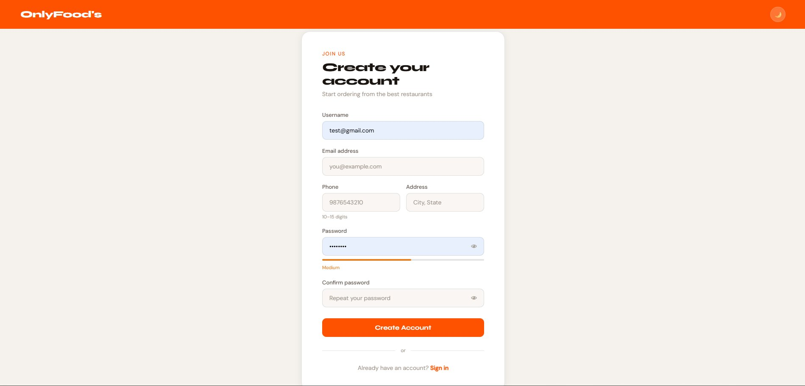 | 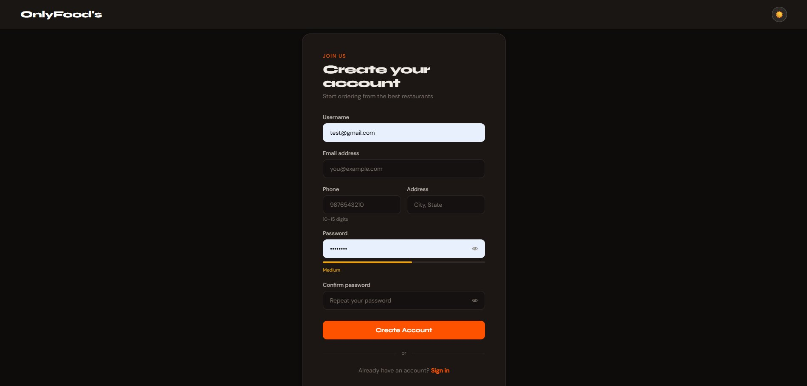 |

> Sign up with username, email, phone, address, and password — with a live password strength indicator.

---

### 2. 🔑 Login

| ☀️ Light Theme | 🌙 Dark Theme |
|:-:|:-:|
| 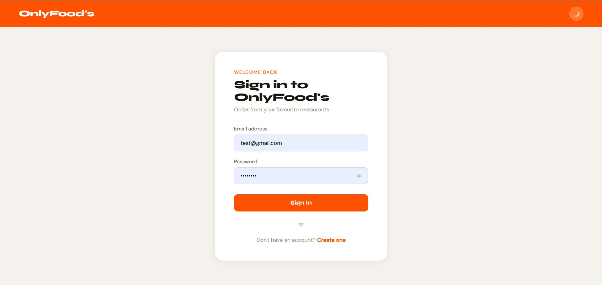 | 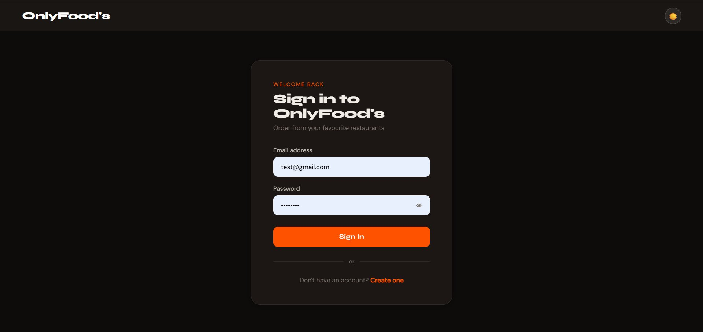 |

> Secure sign-in with email and password.

---

### 3. 🏠 Home — All Restaurants

| ☀️ Light Theme | 🌙 Dark Theme |
|:-:|:-:|
| 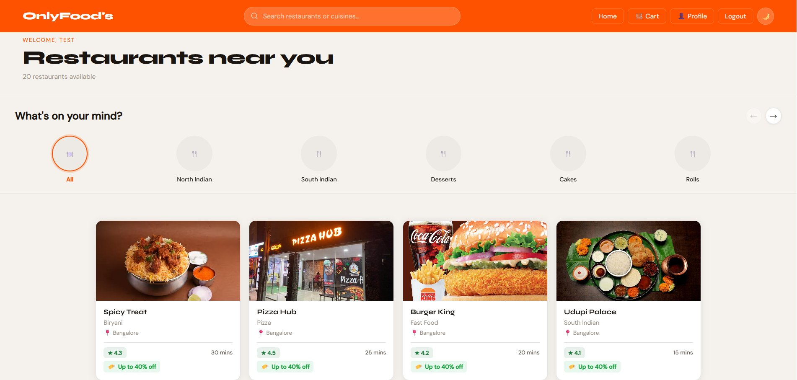 | 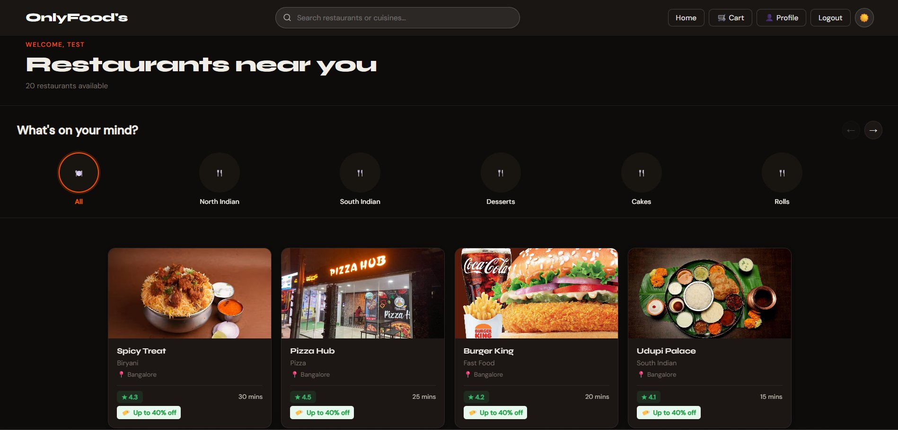 |

> Browse 20+ restaurants with ratings, delivery time, and discount offers.

---

### 4. 🍛 Home — Filtered by Cuisine

| ☀️ Light Theme | 🌙 Dark Theme |
|:-:|:-:|
| 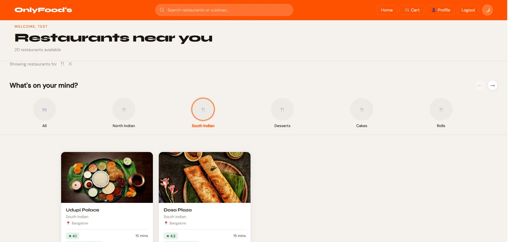 | 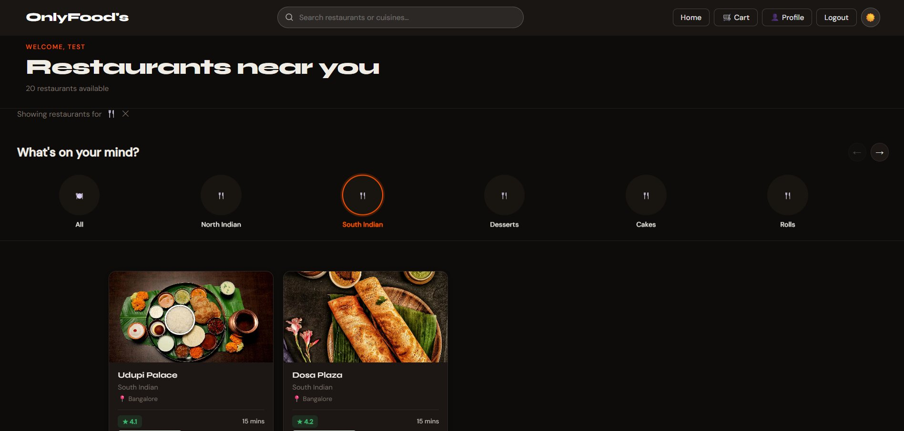 |

> Filter restaurants by cuisine using the horizontal category carousel (e.g., South Indian).

---

### 5. 🍽️ Menu Page

| ☀️ Light Theme | 🌙 Dark Theme |
|:-:|:-:|
| 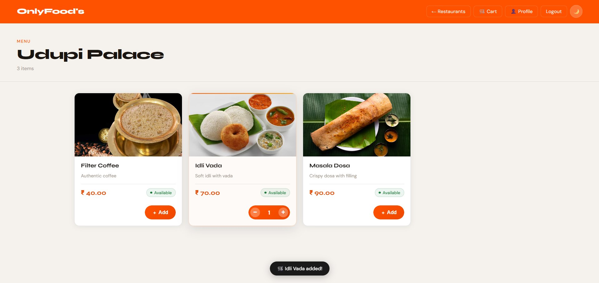 | 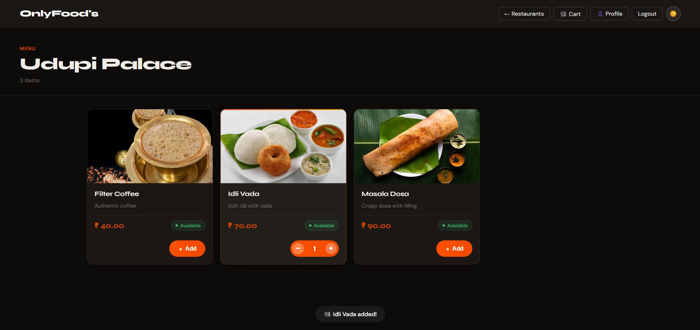 |

> View menu items with prices, availability badges, and add-to-cart controls with quantity stepper.

---

### 6. 🛒 Cart — With Items

| ☀️ Light Theme | 🌙 Dark Theme |
|:-:|:-:|
| 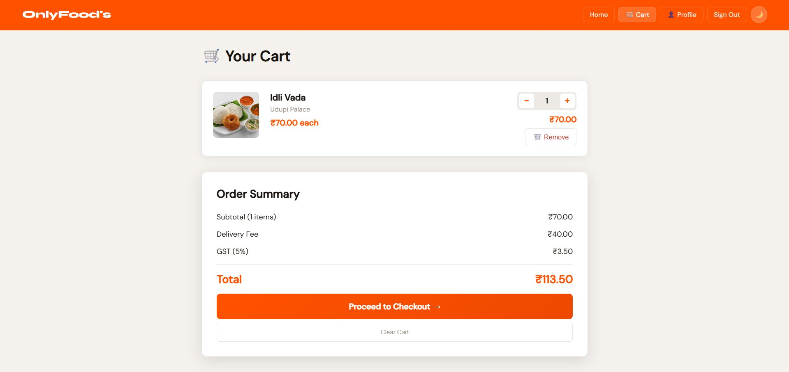 | 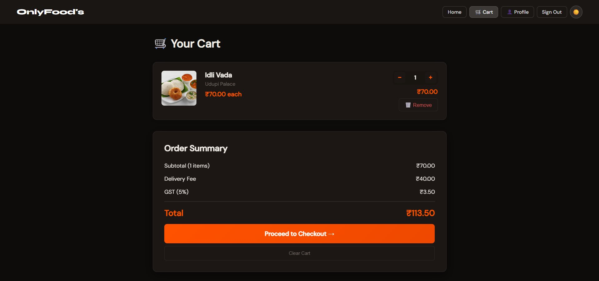 |

> Review cart with itemized pricing — subtotal, delivery fee (₹40), and GST (5%).

---

### 7. 🗑️ Cart — Empty State

| ☀️ Light Theme | 🌙 Dark Theme |
|:-:|:-:|
| 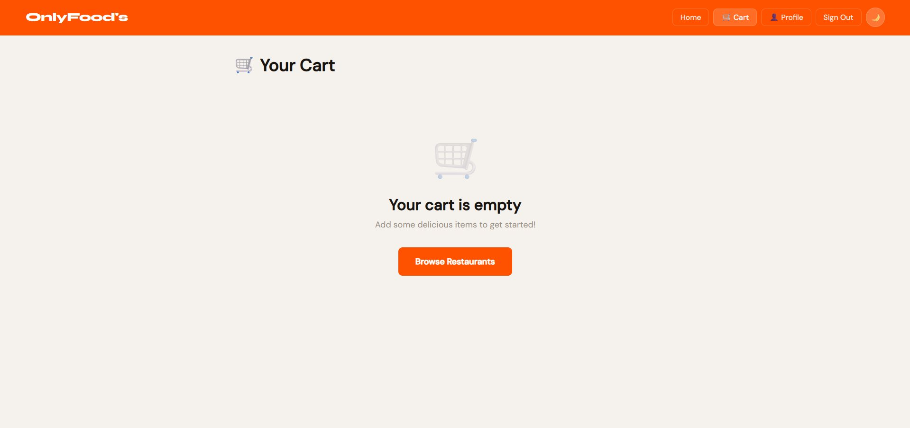 | 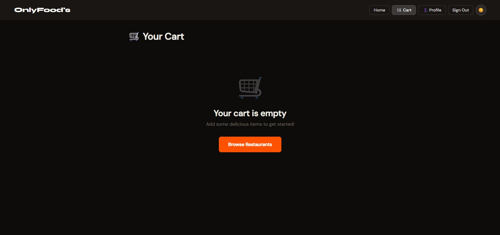 |

> Clean empty state with a prompt to browse restaurants.

---

### 8. 💳 Checkout

| ☀️ Light Theme | 🌙 Dark Theme |
|:-:|:-:|
| 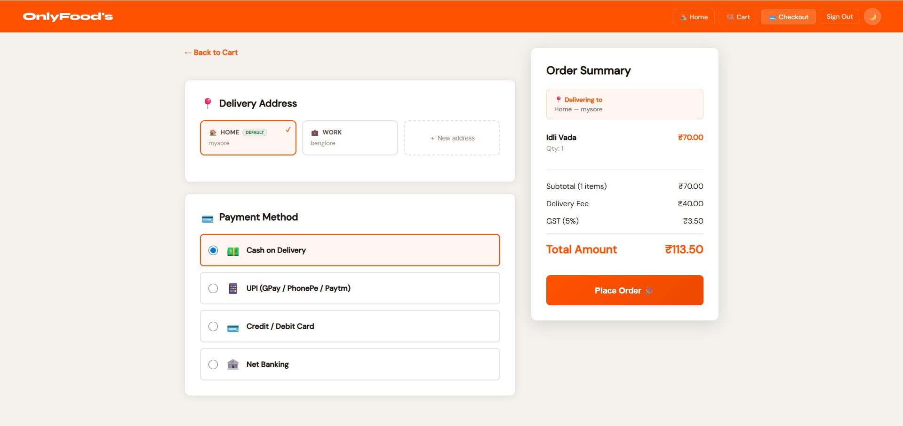 | 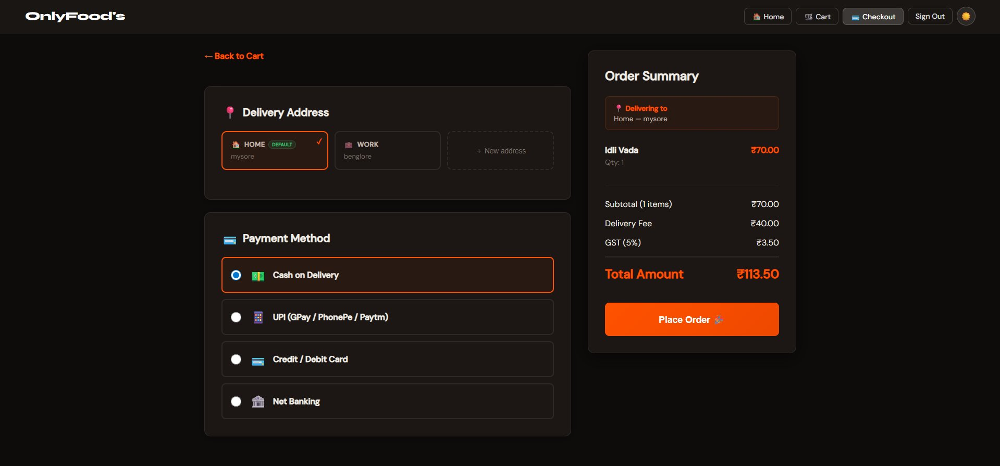 |

> Select delivery address (Home / Work / New) and payment method — COD, UPI, Card, or Net Banking.

---

### 9. ✅ Order Confirmed

| ☀️ Light Theme | 🌙 Dark Theme |
|:-:|:-:|
| 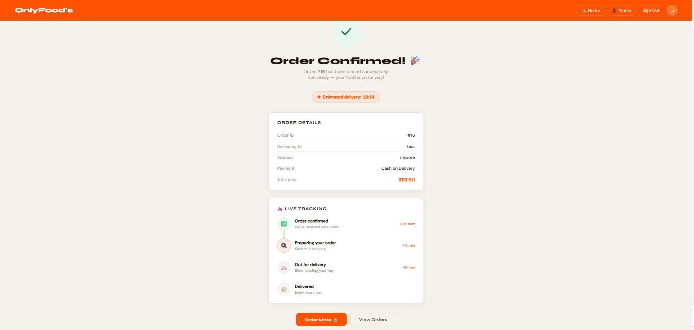 | 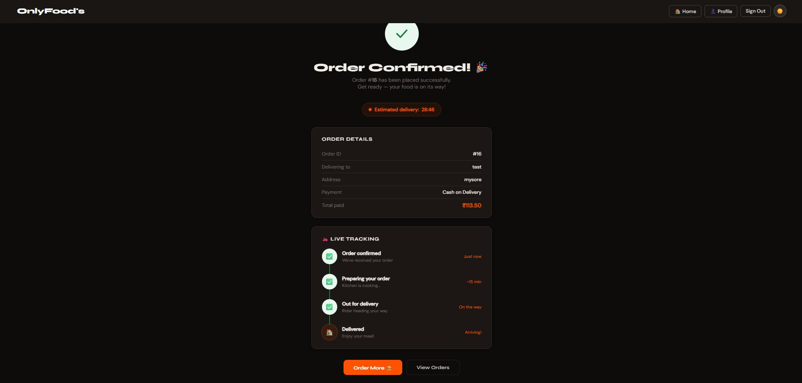 |

> Order confirmation with live tracking stages and estimated delivery countdown.

---

### 10. 👤 Profile

| ☀️ Light Theme | 🌙 Dark Theme |
|:-:|:-:|
| 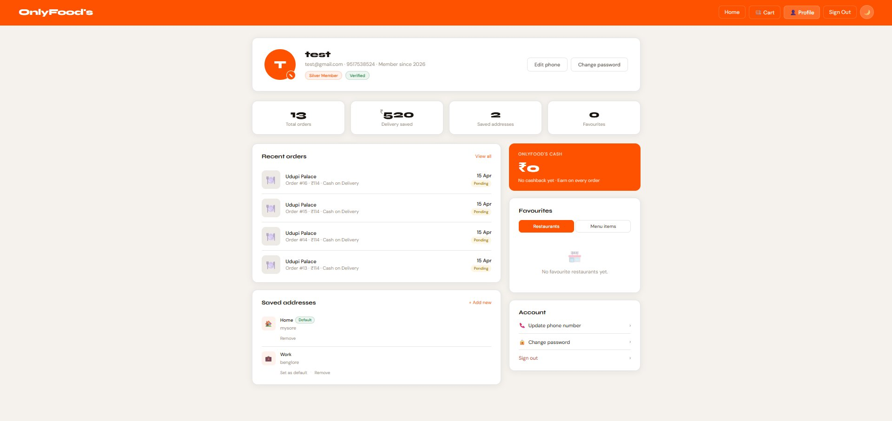 | 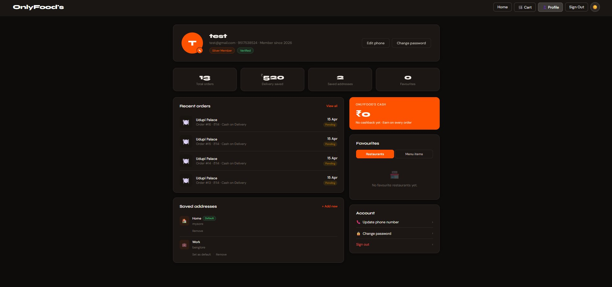 |

> View order history, saved addresses, OnlyFood's Cash, favourites, and account settings.

---

## 🚀 Features

### User Authentication
- Secure user registration with BCrypt password hashing
- Live password strength indicator during registration
- Login/logout functionality with session management
- Password validation and security best practices

### Restaurant & Menu Browsing
- Browse 20+ restaurants with ratings, cuisine types, and delivery times
- Dynamic menu display with item availability badges
- Horizontal category carousel for cuisine-based filtering
- Search bar for restaurants and cuisines
- Discount/offer badges on restaurant cards

### Shopping Cart
- Add/remove items from cart with quantity controls
- Confirmation dialog before clearing entire cart
- Empty state with browse prompt
- Persistent cart storage in session
- Real-time price calculations (subtotal + delivery fee + GST)

### Checkout & Payments
- Delivery address selection (Home / Work / New address)
- Multiple payment methods: Cash on Delivery, UPI (GPay/PhonePe/Paytm), Credit/Debit Card, Net Banking
- Itemized order summary with GST (5%) and delivery fee breakdown

### Order Management
- Comprehensive checkout flow
- Order confirmation page with full order details
- Live tracking stages: Confirmed → Preparing → Out for Delivery → Delivered
- Estimated delivery countdown timer
- Order history accessible from profile

### User Profile
- Order history with status badges (Pending / Delivered)
- OnlyFood's Cash / cashback section
- Saved addresses management (set default, add new, remove)
- Favourites for restaurants and menu items
- Account settings: change password, update phone number
- Silver Member tier badge + Verified badge

### UI/UX
- Responsive design for all screen sizes
- **Dark / Light theme toggle** (sun/moon icon in navbar)
- Modern, Swiggy-inspired interface
- Consistent design system with custom fonts (Syne, DM Sans)
- Orange accent color (`#ff5200`) throughout
- Toast notifications for cart actions (e.g., "Idli Vada added!")

---

## 🛠️ Tech Stack

### Backend
- **Java 17+**
- **Jakarta EE (Servlets, JSP)**
- **Apache Tomcat 10.1**
- **MySQL 8.0+**
- **JDBC** for database connectivity
- **BCrypt** for password hashing

### Frontend
- **JSP (JavaServer Pages)**
- **CSS3** (Custom stylesheets)
- **Vanilla JavaScript**
- **Google Fonts** (Syne, DM Sans)

### Architecture
- **MVC Pattern**
- **DAO Pattern** for data access
- **Servlet-based routing**

---

## 📁 Project Structure

```
OnlyFoods/
├── src/
│   └── main/
│       ├── java/
│       │   └── com/
│       │       └── OnlyFoods/
│       │           ├── model/          # Entity classes
│       │           ├── dao/            # DAO interfaces
│       │           ├── daoimp/         # DAO implementations
│       │           ├── Servlet/        # Servlet controllers
│       │           └── util/           # Utility classes
│       └── webapp/
│           ├── WEB-INF/
│           │   └── web.xml             # Deployment descriptor
│           ├── css/
│           │   └── onlyfoods.css       # Main stylesheet
│           ├── images/                 # Static images
│           └── *.jsp                   # JSP pages
├── database/
│   └── schema.sql                      # Database schema
├── screenshots/
│   ├── light/                          # Light theme screenshots
│   │   ├── register.png
│   │   ├── login.png
│   │   ├── home.png
│   │   ├── home_filtered.png
│   │   ├── menu.png
│   │   ├── cart_items.png
│   │   ├── cart_empty.png
│   │   ├── checkout.png
│   │   ├── order_confirmed.png
│   │   └── profile.png
│   └── dark/                           # Dark theme screenshots
│       ├── register.png
│       ├── login.png
│       ├── home.png
│       ├── home_filtered.png
│       ├── menu.png
│       ├── cart_items.png
│       ├── cart_empty.png
│       ├── checkout.png
│       ├── order_confirmed.png
│       └── profile.png
└── README.md
```

## 📦 Package Structure

```
com.OnlyFoods
├── model               # POJOs (User, Restaurant, Menu, Cartitem, etc.)
├── dao                 # Data Access Object interfaces
├── daoimp              # DAO implementations with JDBC
├── Servlet             # Servlet controllers
└── util                # Helper classes (DBConnector, PasswordUtil, etc.)
```

---

## ⚙️ Installation & Setup

### Prerequisites
- Java Development Kit (JDK) 17 or higher
- Apache Tomcat 10.1+
- MySQL 8.0+
- Eclipse IDE / IntelliJ IDEA (optional)
- Maven (optional, for dependency management)

### Database Setup

1. **Create Database**
```sql
CREATE DATABASE onlyfoods;
USE onlyfoods;
```

2. **Run Schema Script**
```sql
-- Execute the schema.sql file located in /database folder
SOURCE /path/to/database/schema.sql;
```

3. **Configure Database Connection**

Update the database credentials in `DBConnector.java`:
```java
private static final String URL = "jdbc:mysql://localhost:3306/onlyfoods";
private static final String USER = "your_username";
private static final String PASSWORD = "your_password";
```

### Application Setup

1. **Clone the Repository**
```bash
git clone https://github.com/SHREENIDHIMS/OnlyFoods.git
cd OnlyFoods
```

2. **Import Project**
   - Open Eclipse / IntelliJ IDEA
   - Import as existing project
   - Configure build path with required JARs

3. **Add Required JARs**
   - MySQL Connector/J (JDBC Driver)
   - BCrypt library
   - Jakarta Servlet API
   - JSTL (JavaServer Pages Standard Tag Library)

4. **Configure Tomcat**
   - Add project to Tomcat server
   - Set context path to `/OnlyFoods`

5. **Deploy & Run**
   - Start Tomcat server
   - Access application at: `http://localhost:8080/OnlyFoods`

---

## 🎯 Usage

### First Time Users
1. Navigate to the registration page
2. Create an account with username, email, phone, address, and password
3. Log in with your credentials

### Ordering Food
1. Browse available restaurants on the home page
2. Use cuisine filters or the search bar to narrow down restaurants
3. Select a restaurant to view its menu
4. Add items to cart using the `+ Add` button
5. Review your cart and adjust quantities if needed
6. Proceed to checkout
7. Select delivery address and payment method
8. Place order and track it live on the confirmation page

### Theme Toggle
- Click the 🌙 / ☀️ icon in the top-right navigation bar to switch themes
- Preference is saved per session

---

## 🗄️ Database Schema

### Key Tables
- `user` — User authentication and profile data
- `restaurant` — Restaurant information
- `menu` — Menu items with pricing and availability
- `cart` — Shopping cart items (session-based)
- `orders` — Order history
- `orderitems` — Individual items per order

*Refer to `/database/schema.sql` for the complete schema.*

---

## 🎨 Design System

### Colors
- **Primary Orange**: `#ff5200`
- **Dark Theme**: Background `#1a1a1a`, Text `#ffffff`
- **Light Theme**: Background `#f5f5f0`, Text `#000000`

### Typography
- **Display Font**: Syne (headings, brand name)
- **Body Font**: DM Sans (body text, UI elements)

### Components
- Pure CSS theme toggle (checkbox sibling selector)
- Responsive navigation bar with active route highlighting
- Card-based restaurant and menu layouts
- Horizontal scrolling cuisine carousels
- Toast notifications for cart actions
- Live password strength indicator on registration

---

## 🚧 Roadmap

- [ ] Payment gateway integration (Razorpay / Stripe)
- [ ] Real-time order tracking with WebSockets
- [ ] Restaurant partner dashboard
- [ ] Review and rating system
- [ ] Advanced search and filters
- [ ] Push notifications
- [ ] Mobile application

---

## 🤝 Contributing

Contributions are welcome! Please feel free to submit a Pull Request.

1. Fork the repository
2. Create your feature branch (`git checkout -b feature/AmazingFeature`)
3. Commit your changes (`git commit -m 'Add some AmazingFeature'`)
4. Push to the branch (`git push origin feature/AmazingFeature`)
5. Open a Pull Request

---

## 📝 License

This project is licensed under the MIT License — see the [LICENSE](LICENSE) file for details.

---

## 👨‍💻 Author

**Shreenidhi M S**
- GitHub: [@SHREENIDHIMS](https://github.com/SHREENIDHIMS)
- LinkedIn: [Shreenidhi M S](https://www.linkedin.com/in/shreenidhi-m03/)

---

## 🙏 Acknowledgments

- Tap Academy for the internship opportunity
- Swiggy for UI/UX inspiration
- The Jakarta EE community

---

⭐ If you find this project helpful, please consider giving it a star!

**Built with ❤️ using Java & Jakarta EE**
